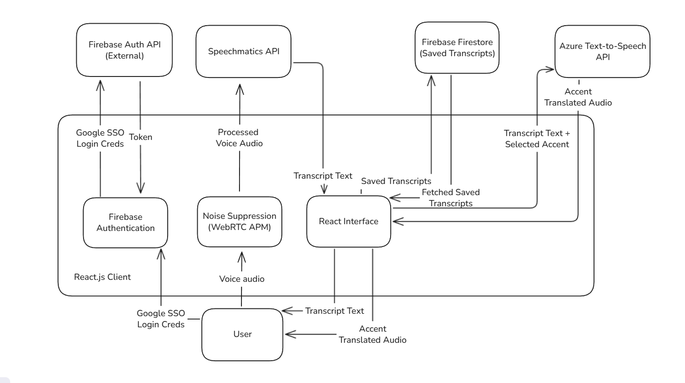

# SystemX - Real-Time Accent Translation

A real-time web application that transcribes your speech and plays it back in different English accents. Built for our capstone project, SystemX uses speaker diarization to identify multiple speakers and lets you choose between American, British, Australian, and Indian accents.

## System Architecture



The application is entirely client-side, with the React frontend communicating directly with three cloud services:
- **Firebase** for authentication and storing transcripts
- **Speechmatics** for real-time speech-to-text with speaker identification
- **Azure TTS** for synthesizing speech in different accents

## Features

- **Real-time transcription** - See what you're saying as you speak
- **Speaker diarization** - Automatically identifies up to 5 different speakers (S1, S2, S3, S4, S5)
- **Multi-speaker voice assignment** - Each speaker gets a unique voice from the selected accent pool
- **Accent translation** - Convert to American (default), British, Australian, or Indian accents
- **Voice options** - Choose male or female voices (5 voice variants per accent/gender)
- **Transcript management** - Save, edit, rename, and delete transcripts in Firebase
- **Enhanced accuracy** - Uses Speechmatics "enhanced" mode with 3-second max delay for better context
- **Confidence-based filtering** - Replaces low-confidence words (< 70%) with placeholders to prevent hallucinations
- **Audio mode toggle** - Switch between Headphones mode (mic stays active) and Speakers mode (mic mutes during playback)
- **AI Summary** - Generate intelligent summaries of your transcripts using DeepSeek V3 via SiliconFlow API

🙌🏻Tips：To achieve the best result and 95+% accuracy rate, please select `headset mode` with real-time conversation. Speaker mode is built only for demonstration to larger audience.

## Tech Stack

- **Frontend**: React 19.1.1 + TypeScript 5.8.3 + Vite 7.1.7
- **Styling**: Tailwind CSS 4.1.14
- **Speech-to-Text**: Speechmatics Real-time Client 7.0.2
- **Text-to-Speech**: Azure Speech SDK 1.46.0
- **Backend Services**: Firebase 12.3.0 (Auth + Firestore)
- **Routing**: React Router 7.9.3
- **Testing** Vitest 2.1.8

## Quick Start

### Prerequisites

- Node.js 22+
- [A Speechmatics API key](https://docs.speechmatics.com/api-ref)
- An Azure Cognitive Services API key [Guidance here](https://docs.azure.cn/en-us/ai-services/multi-service-resource)
- Firebase project credentials [Check Firebase Authentication here](https://firebase.google.com/products/auth)

### Setup

1. **Clone the repository**
   ```bash
   git clone <repository-url>
   cd capstone-project-25t3-9900-h11a-bread
   ```

2. **Install dependencies**
   ```bash
   cd frontend
   npm install
   ```

3. **Configure environment variables**

   Copy `.env.example` to `.env` and fill in your API keys:
   ```bash
   cp .env.example .env
   ```

   Required variables:
   ```
   VITE_SPEECHMATICS_API_KEY=your_speechmatics_key
   VITE_AZURE_SPEECH_API_KEY=your_azure_key
   VITE_FIREBASE_API_KEY=your_firebase_key
   VITE_FIREBASE_AUTH_DOMAIN=your_project.firebaseapp.com
   VITE_FIREBASE_PROJECT_ID=your_project_id
   VITE_FIREBASE_STORAGE_BUCKET=your_project.appspot.com
   VITE_FIREBASE_MESSAGING_SENDER_ID=your_sender_id
   VITE_FIREBASE_APP_ID=your_app_id
   VITE_FIREBASE_MEASUREMENT_ID=your_measurement_id
   VITE_DEEPSEEK_API_KEY=your_deepseek_key  # Optional, for AI Summary feature
   VITE_AZURE_REGION=your_azure_region  # Azure region for TTS service
   ```

4. **Run the development server**
   ```bash
   npm run dev
   ```

   The app will be available at `http://localhost:3000`

## Docker Setup

### Development

```bash
cd frontend
docker-compose up systemx-dev
```

Runs on `http://localhost:3000` with hot reload enabled.

### Production

```bash
cd frontend
docker-compose --profile production up systemx-prod
```

Runs on `http://localhost:8080` served by Nginx.

## Project Structure

```
frontend/
├── src/
│   ├── components/
│   │   ├── Home.tsx              # Main app orchestration
│   │   ├── Login.tsx             # Login page
│   │   ├── NotesPage.tsx         # Saved transcripts viewer with AI summary
│   │   ├── AccentDropdown.tsx    # Accent/gender selector
│   │   ├── AudioModeToggle.tsx   # Headphones/Speakers mode toggle
│   │   ├── Button.tsx            # Reusable button
│   │   └── Header.tsx            # App header
│   ├── context/
│   │   └── AuthContext.tsx       # Firebase auth state
│   ├── firebase/
│   │   └── firebase.ts           # Firebase config
│   ├── hooks/
│   │   ├── useAuth.ts            # Auth hook
│   │   ├── useTranscripts.ts     # Firestore operations
│   │   ├── useSpeechToText.ts    # Speechmatics STT integration
│   │   └── useTextToSpeech.ts    # Azure TTS integration
│   ├── tests/ 
│   │   ├── setup.ts              # Vitetest config
│   │   ├── Login.test.tsx        # Front-end test for login function
│   │   ├── NotesPage.test.tsx    # Front-end test for transcript behaviors
│   │   └── Header.test.tsx       # Front-end test for header behaviors
│   ├── utils/
│   │   ├── auth.ts               # Auth helpers
│   │   └── deepseek.ts           # AI summary integration
│   └── App.tsx                   # Main app component
├── public/
│   └── audio-processor.js        # Audio worklet for processing
├── Dockerfile                    # Production image
├── Dockerfile.dev                # Development image
├── docker-compose.yml            # Docker orchestration
└── package.json                  # Dependencies
```

## How It Works

1. **Audio Capture**: Browser captures audio at 16kHz using Web Audio API
2. **Processing**: Audio is chunked into 20ms frames by an AudioWorklet
3. **Transcription**: Frames stream to Speechmatics WebSocket API (enhanced mode, 3s max delay), which returns transcripts with speaker labels
4. **Speaker Voice Assignment**: Each new speaker gets assigned a unique voice from the selected accent/gender pool (rotates through 5 available voices)
5. **Sentence Detection**: Words buffer until punctuation (`.`, `!`, `?`) is detected
6. **Synthesis**: Complete sentences are sent to Azure TTS with the speaker's assigned voice (non-blocking)
7. **Playback**: Synthesized audio plays through a separate AudioContext to prevent interference

### Key Implementation Details

**Multi-Speaker Voice Assignment**: When a new speaker is detected, they're automatically assigned the next available voice from the accent pool. For example, with American Male selected: S1 gets "Guy", S2 gets "Davis", S3 gets "Tony", etc. This assignment persists throughout the session, and the UI displays each speaker's voice (e.g., "S1 (Guy):").

**Speaker Diarization**: Speechmatics identifies up to 5 speakers and returns labels (S1, S2, S3, S4, S5). We merge consecutive utterances from the same speaker and color-code them (S1=blue, S2=green, S3=purple, S4=orange, S5=pink).

**Confidence-Based Filtering**: Words with Speechmatics confidence scores below 70% are automatically replaced with `[ __ ]` placeholders. This prevents low-confidence "hallucinated" words from being synthesized and played back, improving overall accuracy.

**Audio Mode Control**: Users can choose between two audio modes:
- **Headphones Mode**: Microphone stays active during AI speech playback (ideal when using headphones to prevent echo naturally)
- **Speakers Mode** (default): Microphone automatically mutes during AI speech playback to prevent acoustic feedback

**Echo Prevention**: Browser's built-in echo cancellation is disabled to avoid interference with our real-time processing. The Audio Mode toggle provides manual control over microphone behavior during playback.

**De-duplication**: We track processed message IDs from Speechmatics and normalize text to prevent speaking the same sentence twice.

**Non-Blocking TTS**: Speech synthesis runs asynchronously without blocking transcription processing, ensuring smooth real-time performance even during playback.

## AI Summary Feature

The AI Summary feature uses DeepSeek V3 via SiliconFlow API to generate concise summaries of your transcripts. Simply open any saved transcript and click the purple sparkles (✨) icon to generate a paragraph summary.

**Implementation Details:**
- Automatically truncates transcripts to 12,000 characters to stay within API limits
- Uses adaptive summary length based on transcript size (wordCount/5, minimum 20 words)
- Prevents markdown formatting and bullet points for clean paragraph output

**Setup:**
1. Get a free API key from [SiliconFlow](https://cloud.siliconflow.cn/)
2. Add `VITE_DEEPSEEK_API_KEY` to your `.env` file
3. Restart the development server

**Cost:** Very affordable with SiliconFlow's pricing 

## Available Scripts

- `npm run dev` - Start development server
- `npm run build` - Build for production
- `npm run preview` - Preview production build
- `npm run lint` - Run ESLint
- `npm test` - Run vitetest to test front-end functionalities

## Browser Support

Only works on **Chrome** and **Edge** due to AudioWorklet API requirements.

### Testing

Test files are under `frontend/src/tests`
There are 9 tests to test the front-end behaviors of the website including:

- **NotesPage** test transcripts display, sorting, loading, download in `text` format, grouping by data, AI summery generation, and search by title
- **Header** buttons navigation, user authentication, profile popup toggle
- **LoginPage** Google and facebook authentication redirection, responsiveness

Test them by running `npm test` in terminal in '/frontend'

## Known Limitations

- Requires stable internet connection
- 1-3 second latency due to STT + TTS processing
- API costs (Speechmatics charges per hour, Azure per character)
- Transcription quality depends on microphone and background noise

## Why No Backend?

We originally had a Python FastAPI backend for noise reduction and proxying Speechmatics, but removed it to simplify deployment. The Speechmatics and Azure SDKs work great in the browser, eliminating the need for a server. This also means:
- ✅ Simpler deployment (just static hosting)
- ✅ No server costs
- ✅ Faster development
- ⚠️ API keys in client environment (fine for a demo)

For production, you'd want a thin backend to protect API keys and add usage tracking.

## Team

Capstone Project 25T3-9900-H11A-BREAD

## License

This project is for academic purposes.
